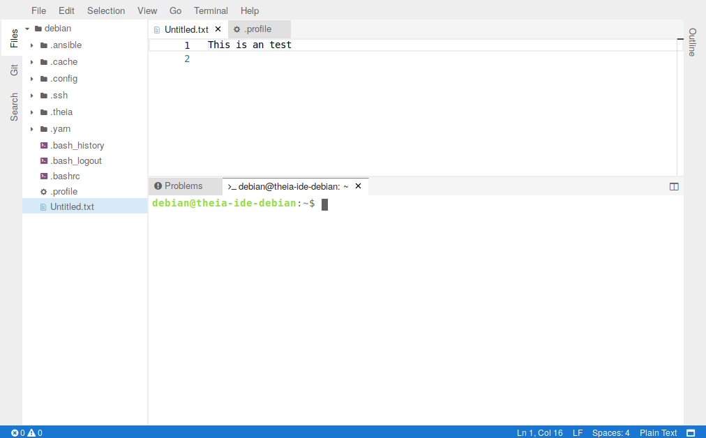

# Theia-IDE
Install and configure  [Theia-IDE](https://www.theia-ide.org) on supported cloud images.



Supported cloud images are:
- [Ubuntu Xenial (16.04) LTS](https://cloud-images.ubuntu.com/xenial/current/) - default user: ubuntu
- [Ubuntu Bionic (18.04) LTS](https://cloud-images.ubuntu.com/bionic/current/) - default user: ubuntu
- [Debian Stretch (9)](https://cdimage.debian.org/cdimage/openstack/current/) - default user: debian
- [CentOS 7](https://cloud.centos.org/centos/7/images/)- default user: centos

Other distros based on Debian or RHEL might also work.
## Configuration

The role comes with an (in my opinion) useful default configuration. 
The following variables are supported and can be used to modify the setup.


- **nvm_install_dir**:  */opt/nvm*
- **theia_ide_user**: default is the *ansible user*
- **theia_ide_workspace**:  default is the *ansible users homedir*
- **theia_ide_install_dir**: */opt/theia-ide*
- **theia_ide_bind_address**: *localhost*
- **theia_ide_bind_port**: *8080*

## Security
**Attention !** Theia-IDE (and also this role) does not come with any kind of auth mechanism.
The idea is to leave the auth part to the webserver / reverse proxy. However if you need this 
feature you have to take care about it by yourself.


## Example playbook 

Depending on your cloud image the playbook (and the hosts file) might look different.

#### hosts
```yaml
[ubuntu1804]
192.168.0.93 ansible_python_interpreter=/usr/bin/python3 ansible_ssh_user=ubuntu

[ubuntu1604]
192.168.0.109 ansible_ssh_user=ubuntu

[debian9]
192.168.0.112 ansible_ssh_user=debian

[centos]
192.168.0.110 ansible_ssh_user=centos


```

#### site.yml
```yaml
- hosts: ubuntu1804
  become: 'yes'
  gather_facts: false
  pre_tasks:
    - name: Install python2 on Ubuntu 18.04 cloud-image 
      raw: bash -c "test -e /usr/bin/python || (apt -qqy update && apt-get install -qqy python-minimal)
      register: output
      changed_when: output.stdout != ""
    - name: Gathering facts
      setup:    
  roles:
  - jkrue.theia_ide


- hosts: ["ubuntu1804","debian","centos"]
  become: 'yes'
  roles:
  - jkrue.theia_ide

```


Run the playbook on all hosts:

```bash
$ ansible-playbook -i hosts site.yml
```
